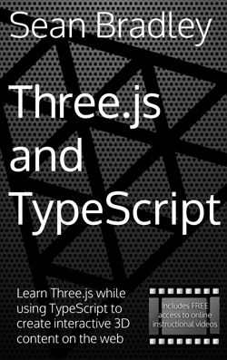

# Straight Car

You can only drive straight.

Play : [https://sc.sbcode.net](https://sc.sbcode.net)


### Desktop

-   Forward : <kbd>W</kbd> or <kbd>Arrow UP</kbd>
-   Backward : <kbd>S</kbd> or <kbd>Arrow Down</kbd>
-   Brakes : <kbd>Space</kbd>
-   Respawn : <kbd>R</kbd>

## Develop

1. Clone Repository

```bash
git clone https://github.com/Sean-Bradley/Straight-Car.git
```

2. CD into folder

```bash
cd Straight-Car
```

3. Install TypeScript

```bash
npm install -g typescript
```

4. Install dependencies

```bash
npm install
```

5. Start it

```bash
npm run dev
```

6. Open browser and visit http://127.0.0.1:8080

For more in depth information on production server deployment options, such as SSL, Domain name & Cloud hosting, visit [https://sbcode.net/threejs/nginx-host/](https://sbcode.net/threejs/nginx-host/)

## FAQs

Q. But, I want a car that can turn?

A. The car in [Straight Car](https://sc.sbcode.net/), doesn't turn. Try instead https://github.com/Sean-Bradley/First-Car-Shooter

## Support

To help support my free projects, please take a look at my **ThreeJS and TypeScript** Book



&nbsp;<a href="https://www.amazon.com/dp/B09GYTKRCH">&nbsp; https://www.amazon.com/dp/B09GYTKRCH</a><br/>
&nbsp;<a href="https://www.amazon.co.uk/dp/B09GYTKRCH">&nbsp; https://www.amazon.co.uk/dp/B09GYTKRCH</a><br/>
&nbsp;<a href="https://www.amazon.in/dp/B09GYTKRCH">&nbsp; https://www.amazon.in/dp/B09GYTKRCH</a><br/>
&nbsp;<a href="https://www.amazon.de/dp/B09GYTKRCH">&nbsp; https://www.amazon.de/dp/B09GYTKRCH</a><br/>
&nbsp;<a href="https://www.amazon.fr/dp/B09GYTKRCH">&nbsp; https://www.amazon.fr/dp/B09GYTKRCH</a><br/>
&nbsp;<a href="https://www.amazon.es/dp/B09GYTKRCH">&nbsp; https://www.amazon.es/dp/B09GYTKRCH</a><br/>
&nbsp;<a href="https://www.amazon.it/dp/B09GYTKRCH">&nbsp; https://www.amazon.it/dp/B09GYTKRCH</a><br/>
&nbsp;<a href="https://www.amazon.nl/dp/B09GYTKRCH">&nbsp; https://www.amazon.nl/dp/B09GYTKRCH</a><br/>
&nbsp;<a href="https://www.amazon.co.jp/dp/B09GYTKRCH">&nbsp; https://www.amazon.co.jp/dp/B09GYTKRCH</a><br/>
&nbsp;<a href="https://www.amazon.ca/dp/B09GYTKRCH">&nbsp; https://www.amazon.ca/dp/B09GYTKRCH</a><br/>
&nbsp;<a href="https://www.amazon.com.br/dp/B09GYTKRCH">&nbsp; https://www.amazon.com.br/dp/B09GYTKRCH</a><br/>
&nbsp;<a href="https://www.amazon.com.mx/dp/B09GYTKRCH">&nbsp; https://www.amazon.com.mx/dp/B09GYTKRCH</a><br/>
&nbsp;<a href="https://www.amazon.com.au/dp/B09GYTKRCH">&nbsp; https://www.amazon.com.au/dp/B09GYTKRCH</a>

and my **ThreeJS and TypeScript** courses at [Udemy](https://www.udemy.com/course/threejs-tutorials/?referralCode=4C7E1DE91C3E42F69D0F), [YouTube (Channel membership required)](https://www.youtube.com/playlist?list=PLKWUX7aMnlEKTmkBqwjc-tZgULJdNBjEd) and [Skillshare](https://skl.sh/2uxctEP)

This is only just the beginning of what you will create.

**Course Discount Coupons** : https://sbcode.net/coupons#threejs

[](https://youtu.be/fS4H7gm7gK4)
